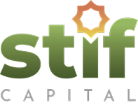

# STIF Capital - Corporate Website



A modern, fast, and secure corporate website for **STIF Capital**. Built with a robust full-stack architecture to handle multilingual content, dynamic business cases, sharia library, insights, and comprehensive site settings via a powerful Admin Panel.

---

## 🚀 Tech Stack

- **Backend:** Laravel 11 (PHP 8.2+)
- **Frontend:** React 18, Inertia.js, Vite
- **Styling:** Custom Vanilla CSS Design System (Bespoke Tokens & Utilities)
- **Admin Panel:** Filament PHP v3
- **Database:** MySQL / MariaDB

## ✨ Key Features

- **Multilingual Support (EN & ID):** Seamless context switching between English and Bahasa Indonesia.
- **Dynamic Content Management:** Full CRUD capabilities for Services, Insights, Sharia Library (Akad), Business Cases, and Team Members.
- **Filament Admin Dashboard:** A sleek, SPA-enabled admin interface to control traffic data, site settings, and portfolio content.
- **Enterprise-Grade Security:**
  - **Honeypot Middleware:** Invisible anti-bot spam protection for all forms (no CAPTCHA required).
  - **Rate Limiting:** Form submission limits to prevent DDoS and spamming (`throttle:5,1`).
  - **Security Headers:** HSTS, X-Frame-Options, XSS Protection enabled.
- **SEO & Tracking Ready:** Manage Google Analytics, GTM, Meta Pixels, and Search Console tags directly from the admin panel.
- **Performance Optimized (100% PageSpeed Goal):** Asynchronous fonts, lazy-loaded images, and Vite vendor chunk splitting.

---

## 📦 Requirements

- PHP >= 8.2
- Composer 2.x
- Node.js >= 18 & NPM / Yarn
- MySQL >= 8.0 or MariaDB >= 10.3

---

## 🛠️ Installation Guide

Follow these steps to set up the project locally:

1. **Clone the repository**
   ```bash
   git clone <repository-url>
   cd STIFCapital
   ```

2. **Install PHP dependencies**
   ```bash
   composer install
   ```

3. **Install Node.js dependencies**
   ```bash
   npm install
   ```

4. **Environment Setup**
   Copy the `.env.example` file and configure your database settings.
   ```bash
   cp .env.example .env
   php artisan key:generate
   ```
   *Note: Update `DB_DATABASE`, `DB_USERNAME`, and `DB_PASSWORD` in your `.env` file.*

5. **Run Migrations & Seeders**
   ```bash
   php artisan migrate --seed
   ```
   *This will set up the database schema and populate it with initial settings and admin user.*

6. **Link Storage**
   Required to display uploaded images from the Admin Panel to the frontend.
   ```bash
   php artisan storage:link
   ```

7. **Run the Development Servers**
   You will need two terminal tabs to run the backend and frontend simultaneously.
   ```bash
   # Terminal 1: Laravel Backend
   php artisan serve

   # Terminal 2: Vite Frontend (Hot Module Replacement)
   npm run dev
   ```

---

## 🛡️ Admin Panel Access

The Content Management System is powered by **Filament PHP**. 
- **URL:** `http://localhost:8000/admin`

If you ran the seeders (`php artisan migrate --seed`), a default admin account might be available. Otherwise, you can easily create a new superadmin user by running:

```bash
php artisan make:filament-user
```
Follow the interactive prompt to set your Name, Email, and Password.

---

## 💡 Available Commands

### Build for Production
To compile and minify frontend assets for production:
```bash
npm run build
```

### Clear Application Cache
If you encounter stale configuration or views:
```bash
php artisan optimize:clear
```

---

## 🖋️ Credits

Developed and Maintained by **PT Mitra Mega Komunika**.
- **Website:** [www.communic8.id](https://www.communic8.id)

© 2026 STIF Capital. All Rights Reserved.
